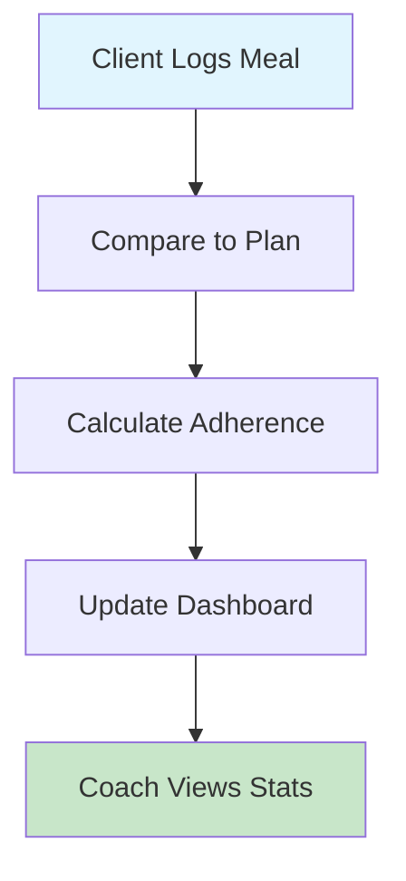

## Overview

Snacko provides comprehensive tools for nutrition coaches to create personalized diet plans, manage clients, and track adherence. Clients can follow their assigned plans, log meals, and monitor their progress. These features work together to make nutrition coaching efficient and effective.

<Columns cols={2}>
  <Card title="Diet Plan Creation" icon="book-open" href="/help-center/guides/create-diet-plan">
    Create personalized diet plans with meal slots, food items, and nutrition goals.
  </Card>
  <Card title="Client Management" icon="users" href="/help-center/guides/manage-clients">
    Add clients individually or in bulk, manage profiles, and track relationships.
  </Card>
  <Card title="Meal Tracking" icon="utensils" href="/help-center/guides/log-meals">
    Log meals quickly and track daily nutrition intake against assigned plans.
  </Card>
  <Card title="Adherence Monitoring" icon="trending-up" href="/help-center/guides/track-adherence">
    Monitor real-time adherence percentages and identify clients who need support.
  </Card>
</Columns>

## For Nutrition Coaches

### Create and Customize Diet Plans

Create personalized diet plans tailored to each client's needs, preferences, and goals.

<Steps>
  <Step title="Set Plan Details" icon="settings">
    Define plan name, start and end dates, diet goals (weight loss, muscle gain, maintenance), and status (active/inactive).
  </Step>
  <Step title="Configure Preferences" icon="heart">
    Set meal types, medical conditions, allergies, cuisine preferences, and eating preferences for each client.
  </Step>
  <Step title="Add Meal Slots" icon="clock">
    Create custom meal slots (Breakfast, Lunch, Dinner, Snacks) with specific times and descriptions.
  </Step>
  <Step title="Add Food Items" icon="search">
    Search the food database and add specific food items to each meal slot with quantities and serving sizes.
  </Step>
  <Step title="Set Nutrition Metrics" icon="target">
    Configure target metrics like calories, protein, carbs, fats, and track progress over time.
  </Step>
</Steps>

<Callout kind="tip">
  You can create templates for common diet plans and customize them for each client to save time.
</Callout>

### Manage Clients and Organizations

Efficiently manage your client base with powerful organization tools.

<Tabs>
  <Tab title="Add Clients" icon="user-plus">
    **Individual Addition:**
    - Add clients via email or phone number
    - Clients receive invitation links to join your organization
    - Track invitation status (invited, accepted, declined)
    
    **Bulk Import:**
    - Upload CSV files with multiple clients
    - Automatically send invitations to all clients
    - Perfect for onboarding large groups
  </Tab>
  <Tab title="Client Profiles" icon="user">
    - View comprehensive client profiles
    - See all assigned diet plans
    - Track adherence statistics
    - Monitor progress metrics
    - View nutrition summaries
  </Tab>
</Tabs>

### Track Client Adherence

Monitor how well clients are following their assigned diet plans in real-time.

**Adherence Features:**
- Real-time adherence percentage per client
- Organization-wide adherence graphs
- Average adherence across all clients
- Identify top deviating clients
- Daily, weekly, and monthly views
- Hourly granularity for detailed analysis

| Client | Plan | Adherence | Status |
|--------|------|-----------|--------|
| John Doe | Weight Loss Plan | 92% | On Track |
| Jane Smith | Muscle Gain Plan | 78% | Needs Attention |
| Bob Wilson | Maintenance Plan | 95% | Excellent |

<Callout kind="success">
  Use adherence data to identify clients who need extra support and adjust plans accordingly.
</Callout>

## For Clients

### View and Follow Assigned Diet Plans

Access your personalized diet plan assigned by your nutrition coach.

<Steps>
  <Step title="View Your Plan" icon="eye">
    See all meal slots with recommended foods, quantities, and meal times.
  </Step>
  <Step title="Log Meals" icon="utensils">
    Mark foods as consumed when you eat them to track adherence.
  </Step>
  <Step title="Add Food Items" icon="plus">
    Add additional food items to meal slots if needed (with coach approval).
  </Step>
  <Step title="Track Progress" icon="bar-chart-3">
    Monitor your adherence percentage and nutrition statistics.
  </Step>
</Steps>

### Personal Use

Use Snacko for your own nutrition goals without a coach.

- Create your own diet plans
- Set personal nutrition goals
- Track daily intake
- Monitor progress independently
- Access the same food database and tracking tools

<Callout kind="info">
  You can switch between coach-assigned plans and personal plans anytime.
</Callout>