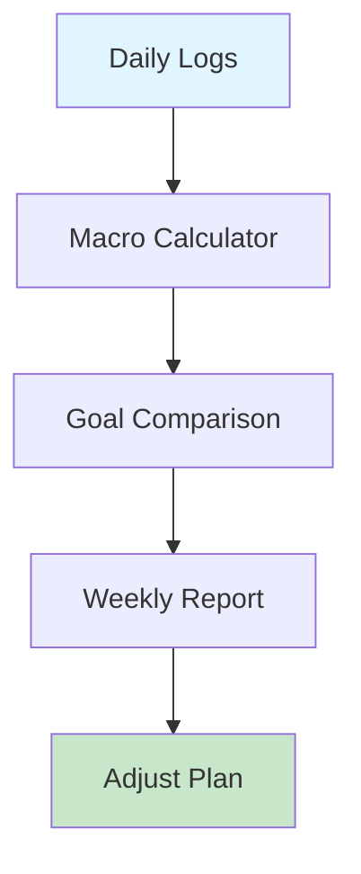

## Overview

Snacko empowers you to build healthier eating habits with personalized tools grounded in behavior science. You generate custom meal plans, track intake effortlessly, receive science-backed tips, and monitor your progress toward nutrition goals. These features work together to make sustainable changes simple.

<Columns cols={2}>
  <Card title="Personalized Plans" icon="book-open" href="#personalized-plans">
    Tailor meals to your preferences, allergies, and goals.
  </Card>
  <Card title="Effortless Tracking" icon="check-circle" href="#tracking">
    Log meals quickly with voice input or photo scan.
  </Card>
  <Card title="Behavior Tips" icon="zap" href="#behavior-tips">
    Get nudges based on proven psychology principles.
  </Card>
  <Card title="Progress Monitoring" icon="trending-up" href="#progress">
    Visualize goals with charts and insights.
  </Card>
</Columns>

## Generating Personalized Meal Plans

Create meal plans that fit your lifestyle. Start by inputting your goals, dietary restrictions, and preferences. Snacko uses an algorithm to suggest balanced plans.

<Steps>
  <Step title="Set Your Profile" icon="user">
    Enter age, weight, activity level, and goals like "lose 10lbs" or "build muscle".

    <Image
      src="https://images.unsplash.com/photo-1504674900247-0877df9cc836?w=800"
      alt="Profile setup screen showing goal inputs"
      width="600"
      height="400"
    />
  </Step>
  <Step title="Choose Preferences" icon="settings">
    Select allergies (e.g., nuts, dairy), cuisines, and macros (e.g., high-protein).
  </Step>
  <Step title="Generate Plan" icon="sparkles">
    Click "Generate" to receive a 7-day plan with recipes and grocery lists.
  </Step>
</Steps>

<Callout kind="tip">
  Update your profile weekly for adaptive plans that evolve with your progress.
</Callout>

## Tracking Daily Nutrition Intake

Log meals in seconds to stay accountable. Snacko recognizes foods from photos and calculates macros automatically.

<Tabs>
  <Tab title="Web App" icon="monitor">
    Use the dashboard at `https://app.snacko.com/track`.

    ```javascript
    // Example API log (for integrations)
    const logMeal = async (mealData) => {
      const response = await fetch('https://api.snacko.com/v1/meals', {
        method: 'POST',
        headers: { 'Authorization': `Bearer ${YOUR_API_KEY}` },
        body: JSON.stringify({
          userId: 'user123',
          meal: 'Grilled chicken salad',
          calories: 450,
          protein: 35,
          carbs: 20,
          fats: 15
        })
      });
      return response.json();
    };
    ```
  </Tab>
  <Tab title="Mobile App" icon="smartphone">
    Snap a photo or use voice: "Log 2 eggs and spinach omelet".
  </Tab>
</Tabs>

## Applying Behavior Science Tips

Snacko delivers micro-habits based on principles like habit stacking and loss aversion. You receive daily tips tailored to your data.

<Expandable title="Common Tips Examples" default-open="true">
  - **Habit Stacking**: Pair logging with your morning coffee routine.
  - **Progress Wins**: Celebrate streaks with virtual badges.
  - **Nudge Alerts**: Gentle reminders when protein dips below `{30g}` daily target.
</Expandable>

## Monitoring Progress Toward Goals

View real-time dashboards to track macros, weight, and habits. Set targets and get insights.



| Metric | Target | Current | Progress |
|--------|--------|---------|----------|
| Calories | `<2000` daily | 1850 | 93% |
| Protein | `>100g` | 120g | 120% |
| Weight | 70kg | 72kg | On Track |

<Callout kind="success">
  Reach 7-day streaks to unlock premium insights.
</Callout>

Integrate with wearables for automatic activity data.

<CodeGroup tabs="JSON,Python">
```json
{
  "userId": "user123",
  "weekSummary": {
    "caloriesAvg": 1920,
    "proteinAvg": 115,
    "adherence": 92
  }
}
```
```python
import requests

response = requests.get(
    'https://api.snacko.com/v1/progress/user123',
    headers={'Authorization': 'Bearer YOUR_TOKEN'}
)
print(response.json()['adherence'])  # 92
```
</CodeGroup>